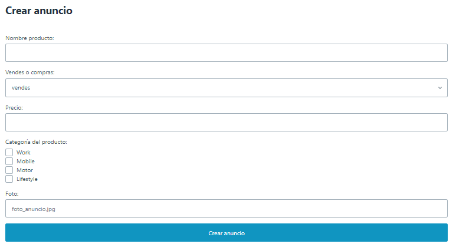

# Proyecto módulo Desarrollo Backend con Node.js

## ¿ En que consiste ?

Esta práctica consiste en la creación de una API para el servicio de comercio de artículos de segunda mano llamado Nodepop. La API permitirá gestionar anuncios de compra/venta, ofreciendo la capacidad de filtrar la búsqueda por diversos campos. También se podrán crear, modificar o eliminar los anuncios según sea necesario.

Además de la API, la aplicación dispondrá de una página web que mostrará los anuncios con todos sus detalles, extraídos directamente de la base de datos.

Os proporciono el fichero con la explicación de la [práctica](./Fundamentos%20Backend%20-%20Práctica%20Web16.pdf) para una comprensión más completa.

## Pasos a seguir para poder utilizar la aplicación

#### <u> Instalar MongoDB en vuestro dispositivo: </u>

Descargar MongoDB de su [página web](https://www.mongodb.com/try/download/community).

Después de instalar MongoDB, inicia el servidor y mantenlo en ejecución.

#### <u> Clonar el repositorio: </u>

Copiar el siguiente comando en el directorio de vuestra elección:

```sh
git clone git@github.com:Cespuess/practica_fundamentos_backend_node.js.git
```

#### <u> Instalar dependencias: </u>

```sh
cd nodepop

npm install
```

#### <u> Inicializar la base de datos:</u>

⚠️ **CUIDADO**, el siguiente comando borra **TODA** la base de datos!!!

```sh
npm run init-db
```

## Desarrollo

Para ejecutar la aplicación en modo desarrollo utilizar:

```sh
npm run dev
```

## API

#### <u> Para consultar la lista completa:</u>

* `GET /api/anuncios`

```json
{
  "resultados": [
    {
      "_id": "65db0c0e30f2a9b2148b947e",
      "nombre": "ratón Logitech",
      "venta": true,
      "precio": 55,
      "foto": "raton.jpg",
      "tags": [
      "work"
      ]
    }
  ]
}
```

#### <u>Consultar con posibilidad de paginación y ordenación:</u>

* ` GET /api/anuncios?skip=2&limit=6&sort=precio`

Términos de paginación y ordenación:
- **skip**: Es la cantidad de anuncios que se ignoran al principio. Tiene que ser numérico.
- **limit**: Es la cantidad de anuncios que se mostrarán como máximo. Tiene que ser numérico. 
- **sort**: Es el campo por el que se ordenarán los resultados. Los campos son: *_id, nombre, venta, precio, foto y tags.*


#### <u>Consultar por campos:</u> 

* `GET /api/anuncios?venta=true`

Indicamos el campo con el valor que queramos buscar: *_id, nombre, venta, precio y tags.*

#### <u>Consultar por rangos de precio:</u>

* `GET /api/anuncios?precio_min=110&precio_max=600`

Si se especifica en la query el campo *precio* junto con *precio_min* y/o *precio_max*, se dará prioridad a la búsqueda por rango de precio. Los valores tendrán que ser de tipo numérico.

#### <u>Consultar por nombre:</u>

* `GET /api/anuncios?nombre=logi`

No hace falta especificar el nombre entero, solo escribir una parte que contenga el título del producto ya es suficiente.

#### <u>Consultar solo los campos seleccionados:</u>

* `GET /api/anuncios?fields=nombre%20-_id`

Con este ejemplo recibimos solo los nombres de los productos sin el _id.

```json
{
  "resultados": [
    {
    "nombre": "Móvil OPPO A78"
    },
    {
    "nombre": "Móvil Iphone 13"
    },
  ]
}
```

#### <u> Consultar los tags disponibles:</u>

* `GET /api/anuncios/listatags`

Devuelve un array con los tags disponibles de los anuncios.

```json
{
  "resultado": [
      "work",
      "lifestyle",
      "motor",
      "mobile"
  ]
}
```

#### <u>Crear un anuncio:</u>

* `POST /api/anuncios (body)`

Para crear un anuncio tendremos que pasar los campos requeridos:
1. `nombre:` tipo string.
2. `venta:` tipo booleano, **true** para indicar que se vende, **false** para indicar que se compra.
3. `precio:` tipo number.
4. `foto:`tipo string.
5. `tags:` tipo [string].


Body:


Respuesta:

```json
{
  "anuncioCreado": {
      "nombre": "coche",
      "venta": false,
      "precio": 234,
      "foto": "coche.jpg",
      "tags": [
          "motor",
          "mobile"
      ],
      "_id": "65e0dfd9168c05b1ea4bf000",
      "__v": 0
  }
}
```

#### <u>Modificar un anuncio:</u>

* `PUT /api/anuncios/<_id>  (body)`

Para modificar el anuncio tendremos que indicar en la URL el _id del anuncio a modificar, y en el body los campos con los valores a actualizar.

Body:


Respuesta:

```json
{
  "anuncioModificado": {
      "_id": "65e0d8af808fa9fe424c0a36",
      "nombre": "casa",
      "venta": true,
      "precio": 220,
      "foto": "teclado.jpg",
      "tags": [
          "lifestyle"
      ],
      "__v": 0
  }
}
```

#### <u>Eliminar un anuncio:</u>

* `DELETE /api/anuncios/<_id>`

Para eliminar un anuncio tendremos que indicar en la URL el _id del anuncio a eliminar.


```json
{
  "productoEliminado": {
      "_id": "65e0d8af808fa9fe424c0a36",
      "nombre": "casa",
      "venta": true,
      "precio": 220,
      "foto": "teclado.jpg",
      "tags": [
          "lifestyle"
      ],
      "__v": 0
  }
}
```

## WEB

#### <u>Diseño de la web:</u>

Los productos se muestran uno encima de otro en el centro de la pantalla con el siguiente orden de información:

1. Nombre del producto.
2. Si se busca o se vende.
3. La categoría (tag).
4. El precio.
5. La foto del producto.


#### <u>Para consultar la lista completa de productos:</u>

* `GET /`

#### <u>Consultar con posibilidad de paginación y ordenación:</u>

* `GET /?skip=2&limit=6&sort=precio`

Términos de paginación y ordenación:
- **skip**: Es la cantidad de anuncios que se ignoran al principio. Tiene que ser numérico.
- **limit**: Es la cantidad de anuncios que se mostrarán como máximo. Tiene que ser numérico. 
- **sort**: Es el campo por el que se ordenarán los resultados. Los campos son: *_id, nombre, venta, precio, foto y tags.*

#### <u>Consultar por campos:</u> 

* `GET /?venta=true`

Indicamos el campo con el valor que queramos buscar: *_id, nombre, venta, precio y tags.*

#### <u>Consultar por rangos de precio:</u>

* `GET /?precio_min=110&precio_max=600`

Si se especifica en la query el campo *precio* junto con *precio_min* y/o *precio_max*, se dará prioridad a la búsqueda por rango de precio. Los valores tendrán que ser de tipo numérico.

#### <u>Consultar por nombre:</u>

* `GET /?nombre=logi`

No hace falta especificar el nombre entero, solo escribir una parte que contenga el título del producto ya es suficiente.

#### <u>Consultar solo los campos seleccionados:</u>

Esta opción no está disponible en la web, solo en la API.

#### <u>Creación anuncio por formulario:</u>

Podremos crear un anuncio desde la página web utilizando el formulario. Todos los campos son obligatorios, y se requiere seleccionar al menos una **categoría**. 
En esta versión el campo `foto` tiene que ser de tipo string. Estamos trabajando para que en futuras versiones sea disponible subir la imagen. 



## Registro de cambios

### v1.0.1
* Mensaje inicial de la página web actualizado.
* Los anuncios iniciales se han transladado de `init-db.js` a `anuncios.json` para mejorar la legibilidad del código y facilitar su mantenimiento.

### v1.1
* Se ha implementado un formulario en la página web que permite la creación de nuevos anuncios. 

### v1.1.1
* Se ha creado la ruta `/api/anuncios/listatags` que proporciona un array con los tags disponibles.
* Se ha mejorado la búsqueda por tags.
* Validadores convertidos en objetos para una mejor legibilidad del código.

### v1.1.2

* Se ha estilizado la página web.